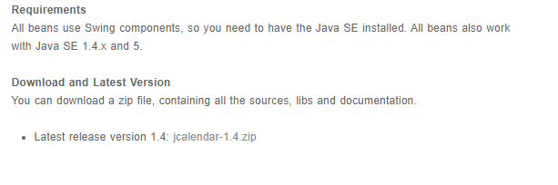

<h2>
    

        Heriot-Watt University <small>Edinburgh Campus</small>
    

</h2>
<h3>
    

        Advanced Software Engineering (F21AS) CourseWork 
    

    
(Group 4)

</h3>

<h4>Group Members:</h4>
<ul>
    <li>Aurelien Andrieux </li>
    <li>Bille Ibinabo</li>
    <li>Carl-Olivier N’Diaye</li>
    <li>Diepreye Yabrifa</li>
    <li>Muhammad Abu Bakar</li>
</ul>

<h4>How to Run the code:</h4>

Visit <a href="https://toedter.com/jcalendar/">jcalendar</a>, 
download the date picker library and add to the project 
(see the image where to download is on the website). 

 Also ensure to install JUnit 5 library to run the unit test as well.

Open the project in your IDE (e.g. Eclipse or Intellij Idea), build the project and run it.
